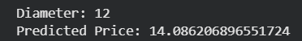
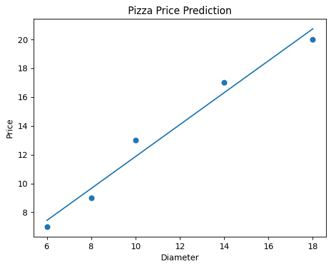

# Pizza Price Prediction
The price of the pizza is predicted from the diameter by using Linear Regression model. 

## Dataset
The dataset contains pizza diameters and the corresponding prices.
| Diameter | Price |
|----------|-------|
| 6        | 7     |
| 8        | 9     |
| 10       | 13    |
| 14       | 17    |
| 18       | 20    |

# Linear Regression
Linear regression is a supervised machine learning algorithm which is used to predict continuous numerical values. The Linear Regression model will learn the relationship between pizza diameter and the pizza price using a best-fit line.

# Steps:
1. Create the dataset
2. Load the dataset
3. Separate the input and output variables
4. Train the Linear Regression model
5. Predict pizza prices
6. Visualize the regression line

# How to run
Open the notebook in Google Colab -> Upload the dataset file 'pizza.csv' -> run the cells sequentially

# Outputs
Prediction:

Regression Graph:

